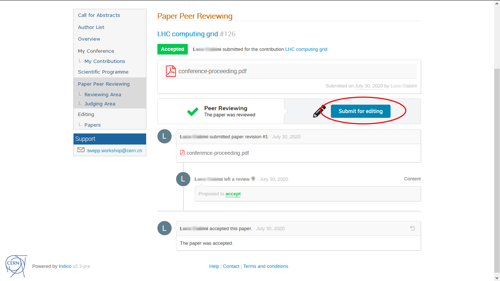
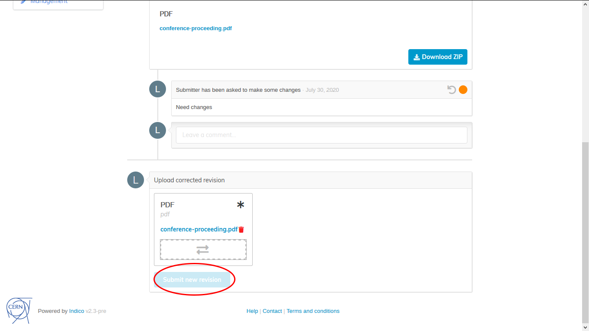
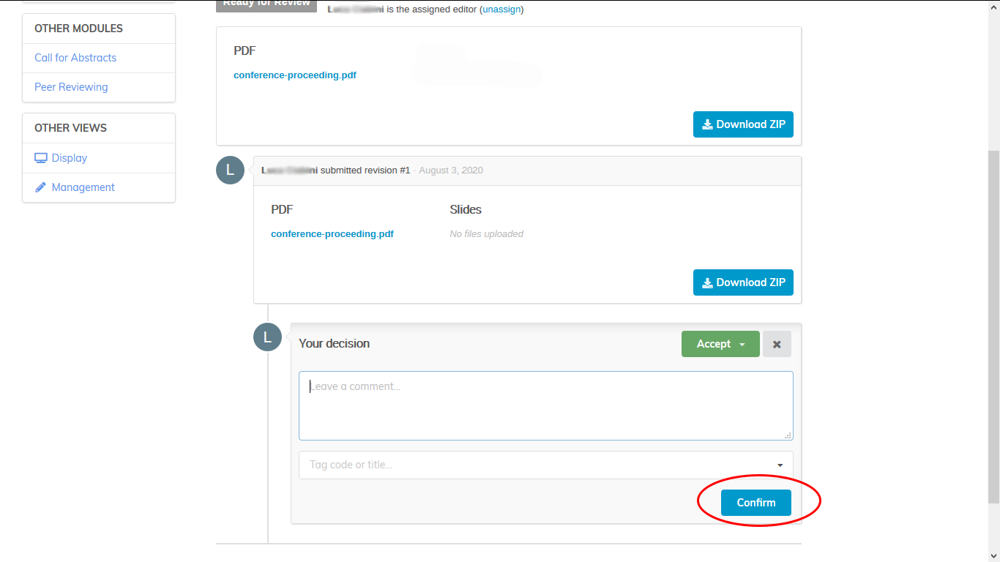

This short video explains the editing process in Indico:

<iframe width="576" height="360" frameborder="0" src="https://cds.cern.ch/video/2275653?showTitle=true" allowfullscreen></iframe>

Read about this process in detail below.

**Note:** one module between paper peer _review_ or _editing_ must be enabled to upload paper, poster, or slides.
###Editing management
From the event management page, click _Editing_ on the left banner, under _Workflows_.

Click _enable module_ to enable the editing module.

Click on the toggle switch to configure which editable types are enabled, you can choose between:
- Paper
- Slides
- Poster

Click save to apply the changes.

If editing module used together with paper peer reviewing then the latter (which is about the content / scientific correctness of the paper) happens first and "layout reviewing" would likely be disabled, and once the peer reviewing is done, then the paper can be submitted for Editing.

Is possible to use editing without paper reviewing enabled as well: in that case the user uploads a paper or slides or poster for editing and the event organizers will just review if if it's good to be published.

Click on Manage to access the editing management page.

Click on the _start now_ button at the right of submission is not open **(1)** to open the submission for new editables.

Click on the _start now_ button at the right of editing is not open **(2)** to allow editors review the submissions.

Click on _Manage teams_ **(3)** to open teams management and add or cancel editors.

Click on _List_ **(4)** to open the list of submission and assign each of them to an editor.

###As a submitter
#####If paper peer review has been activated
Once the paper is accepted from the display view, as a submitter, click on _paper peer reviewing_ section and click submit for editing:

Upload the file you want to submit and then click on _submit_.

If the editor asks for a correction you will be able to submit a new file via editing section.
Select the new file and then click on _submit new revision_

If you want to upload also slides and poster for editing follow the indication in the next section. 
#####If paper peer review has not been activated
From the event display view, as a submitter, click on _my contributions_ under _My conference_.
See the list of your contributions and click on the contribution or which you want to upload material.

Under the _Editing_ section click on the drop-down menù and select the material you want to upload.

Upload the files and then click the _submit_ button.

###As an editor
From the event display view, as an editor, click on the editing area.
See the list of materials you are an editor of.
Click on the paper you want to review to access it.

Under the submission you will see a textbox to add a comment and a drop-down menù where you can choose an action:
- _Accept_ to accept the editable
- _Reject_ to reject the editable
- _Make changes_ to upload a modified document
- _Request changes_ to ask for a change

Click on confirm to apply the judgement.

