This short video explains the peer review process and the Reviewer's and Judge's role in Indico:

<iframe width="576" height="360" frameborder="0" src="https://cds.cern.ch/video/2275653?showTitle=true" allowfullscreen></iframe>

Read about this process in detail below.

**Note:** one module between paper peer _review_ or _editing_ must be enabled to upload paper, poster, or slides.

###Peer reviewing management

From the event management page, click _Peer reviewing_ on the left banner, under _Workflows_.

Click _enable module_ to enable the paper peer reviewing module.

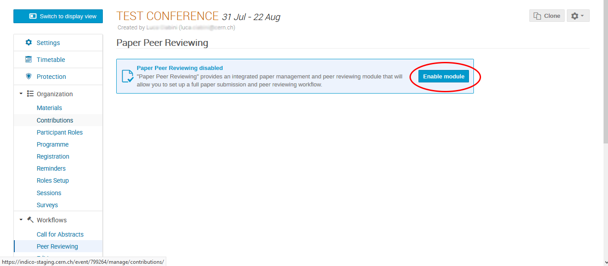

In the management page click _start now_ to open the call for papers.

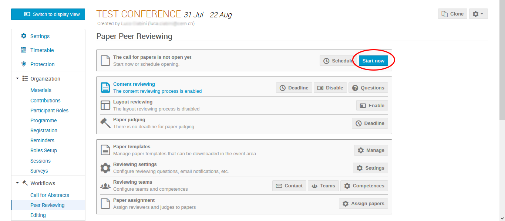

From the management page you can also enable content reviewing, layout reviewing -generally only if the editing module is not activated (see editing docs)-,
and set a deadline for paper judging.

To set teams responsabilities click on _teams_.

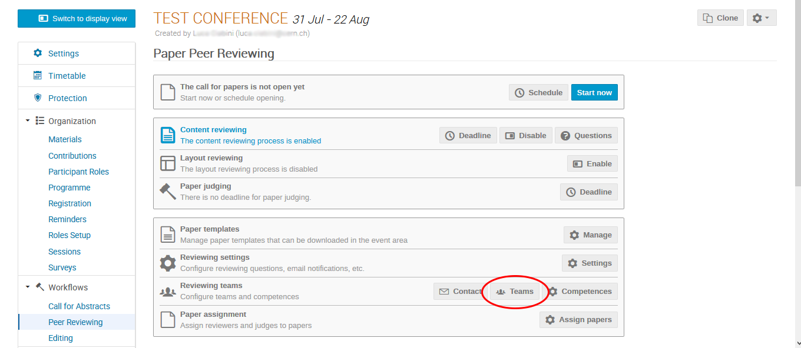

From this page you can now select the _paper managers_, _paper reviewers_ and _paper judges_.

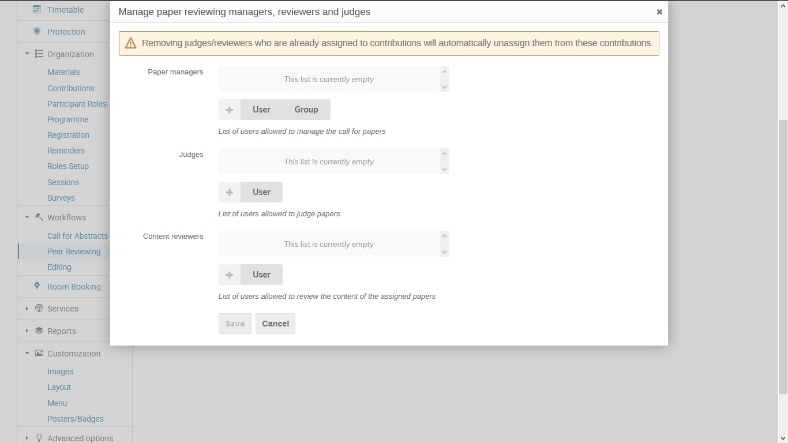

Click on _assign papers_ to open the list of papers and assign each of them to the reviewer and the judge.

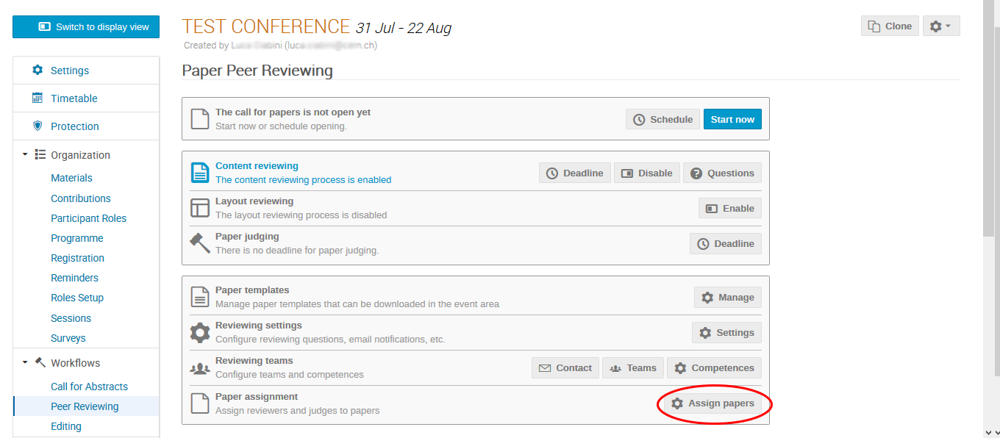

###As a paper submitter
Once the abstract is accepted by a judge, from the event display view, as a paper submitter, click on the paper peer reviewing area.

You will see the list of your accepted abastract. Click on submit paper for the abstract you desire.

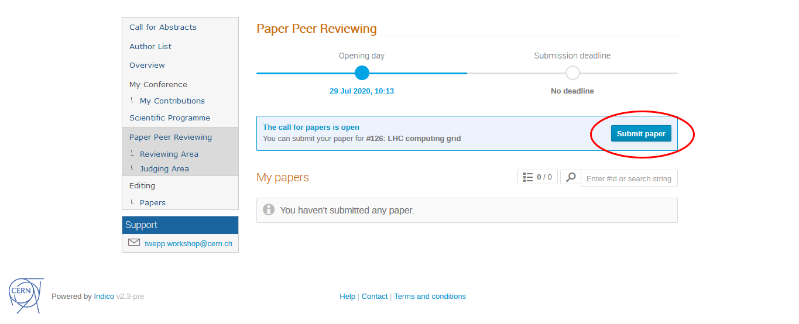

Now you will be asked to select a paper from your pc. 

After selecting the paper click save.

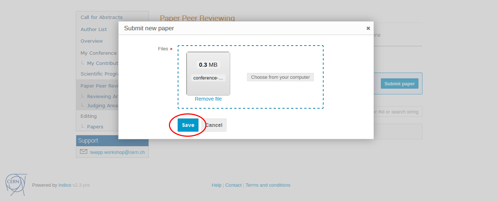

In the case the judge of your paper give the judgment: "_To be corrected_" to your paper you will be able
to submit a new revision of the paper in the paper peer reviewing area.

Select the new revision and then click on _submit new revision_.

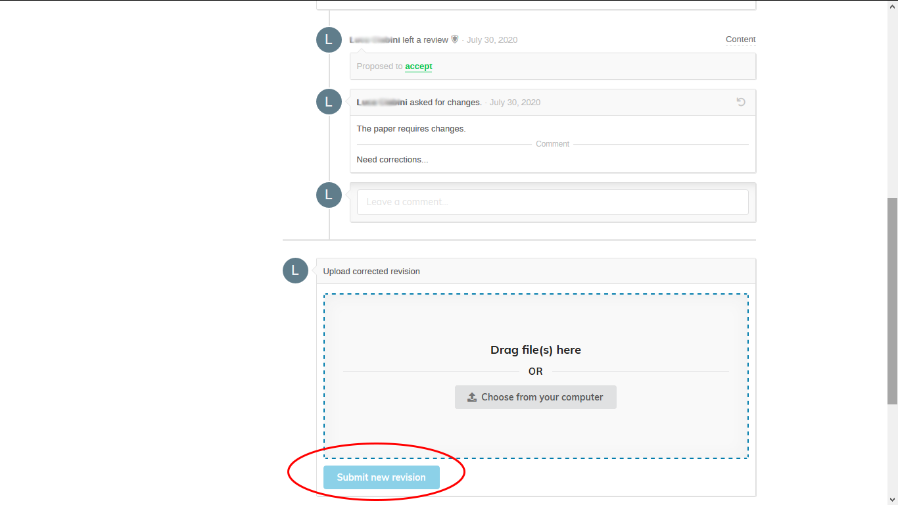
###As a paper reviewer

From the event display view, as a paper reviewer, click on the paper peer reviewer-reviewing area.
See the list of papers you are a Reviewer of.
Click on the paper you want to review to access it.

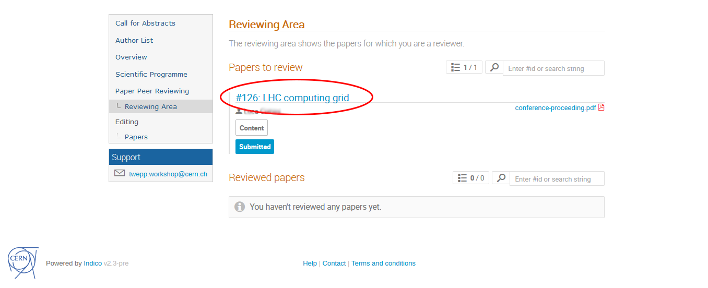

Under the submission you will see a textbox to add a comment and a button to review the paper.
Click _review_.

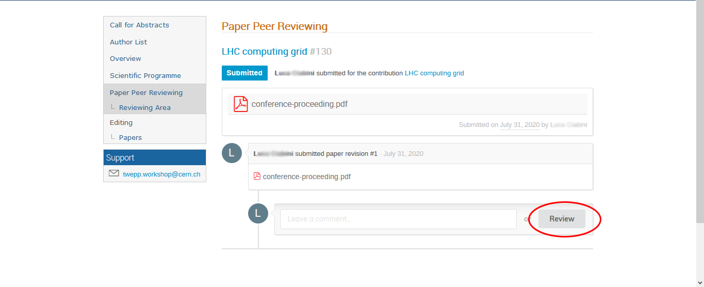

You will now see a drop-down menù **(1)** where you can choose one action:
- "_Accept_" to accept the paper
- "_Reject_" to reject the paper
- "_To be corrected_" to ask for corrections

You can also add a comment.

Click on _submit review_ **(2)** to submit the review.

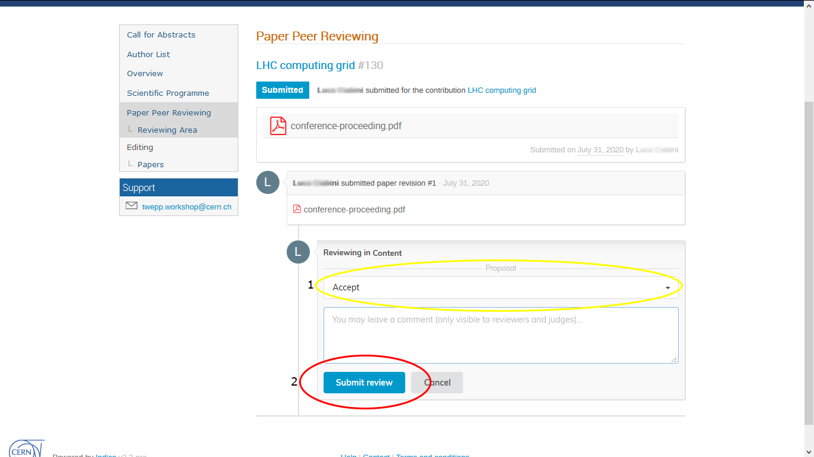

###As a paper judge
From the event display view, as a paper reviewer, click on the paper peer reviewer-judging area.
See the list of papers you are a Judge of.
Click on the paper you want to judge to access it.

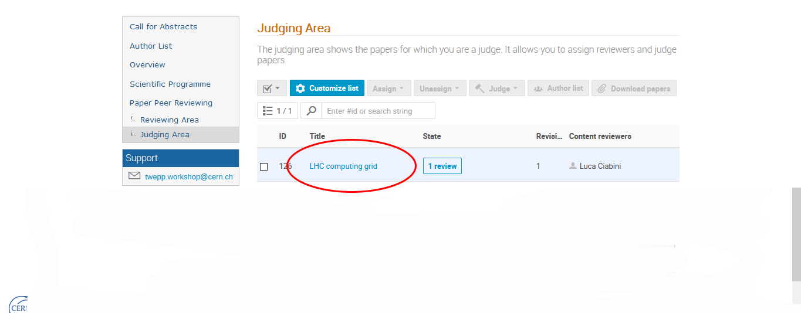

You will now see a drop-down menù where you can choose one action:
- "_Accept_" to accept the paper
- "_Reject_" to reject the paper
- "_To be corrected_" to ask for corrections

You can also add a comment.

Click on _judge_ **(2)** to submit the judgement.

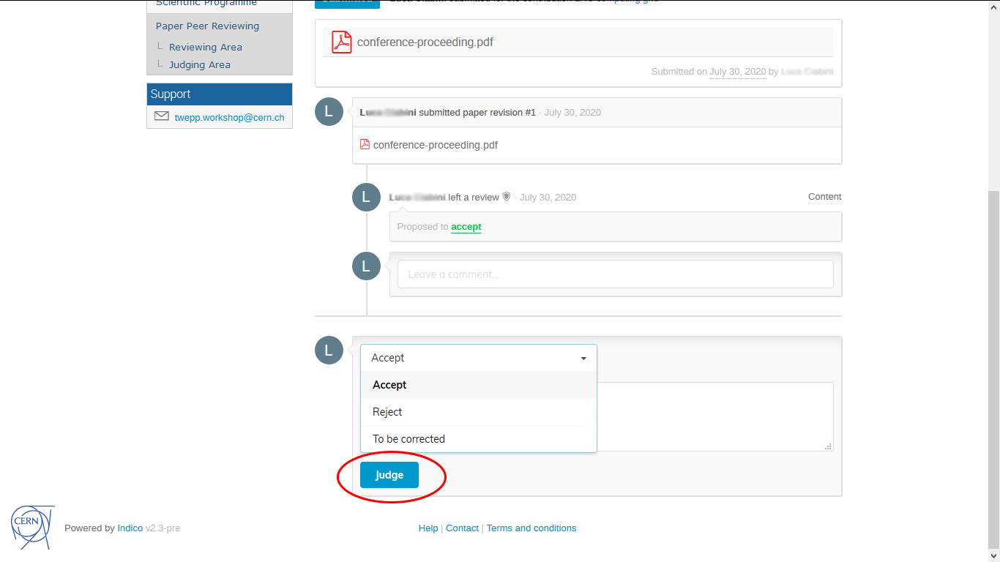